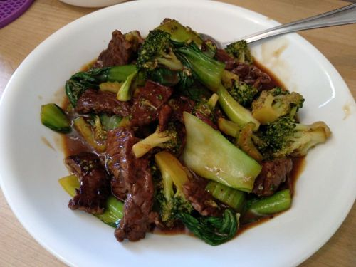

# Beef and Broccoli

Serves 1

## Marinade
* 200g of beef (I’m using chuck tender)
* 1 Tb of Chinese cooking wine
* 2 tsp of light soy sauce
* 1 tsp of cornstarch
* 1/2 tsp of black pepper
* 1/4 tsp of baking soda
* 1 tsp of oil

## Sauce
* 1 Tb of oyster sauce
* 1 Tb of light soy sauce
* 1 tsp of dark soy sauce (just for the color)
* 3 Tb of water 
* 2 tsp of cornstarch
* 1 tsp of sugar
* 1 tsp pepper to taste

## Ingredients

* 1 cup of broccoli
* 1 Tb of minced garlic

## Extras

* bok choy
* cellary
* onion

## Method

1. Slice your beef into thin pieces. I am using chuck tender. Make sure you cut against the fiber. This way, your beef will be less chewy.
2. Marinate it with 1 Tb of Chinese cooking wine, 2 tsp of light soy sauce, 1 tsp of cornstarch, some freshly ground pepper and 1/4 tsp of baking soda. This is what Chinese restaurants do to tenderize the beef- especially if they are using a tough cut of beef. Without baking soda, it’s gonna be a disaster.
3. After it is well combined. We make the sauce. 1 Tb of light soy sauce, 1 Tb of oyster sauce, 2-3 Tb of water, 2 tsp of cornstarch, some black pepper
4. Cut the broccoli into bite sizes. Blanch it in boiling water for 1 or 2 minutes. Don’t cover it or else the broccoli will lose its green color. Turn off the heat and put it into ice water for 3-5 minutes to stop the cooking process. Take it out and shake off the excess water. Using this technique, the broccoli will stay fresh and crunchy. 
5. Next, fry the beef. Heat up about 1 Tb of oil. Give it a toss so the bottom is coated nicely.  
6. Add in the beef. Try to separate it so most of the beef touches the bottom of the wok. Let one side fry for 15-20 seconds. Use your spatula to flip it over and fry the other side for 15-20 seconds. You should also be able to smell the scent of the smoky beef. So good. Take it out and set it aside. 
7. In the same wok, add a little bit of oil. Put in some garlic and give it a stir. Pour the sauce into the hot wok. It will start thickening quickly. Then add in the broccoli. Mix it a little bit. Add the beef back into the wok. Coat it nicely. You are done.

## Notes

https://www.youtube.com/watch?v=9nzlWBw6HyQ&list=WL&index=17

