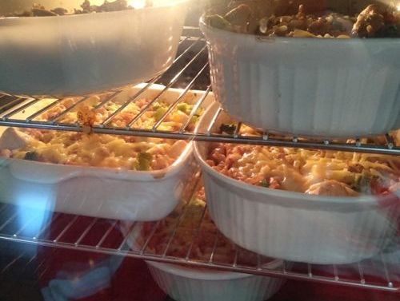

# Chicken Broccolli Pasta Casserole

Serves 18

## Ingredients

* 1.5kg Chicken
* 1kg Wholemeal pasta spirals
* 5cup Chicken stock
* 500g Cashews
* 500g Mixed frozen veg
* 500g Frozen broccolli
* 3cup Milk
* 4tsp Garlic powder
* 4tsp Paprika
* 4tsp Cornflour
* Salt & Pepper
* 500g Cheddar cheese (optional?)

## Method

1. Dice and brown chicken, season in garlic powder and paprika
2. Pour pasta into casserole dish and pour over chicken stock & frozen veg. Cook for 15 minutes @ 190 degress
3. Mix cachews, milk, garlic powder, paprika, cornflour, salt & papper
4. Add chicken and sauce, mix in. Cook for 15 minutes
5. Mix again and cook for another 15 minutes
6. Mix again, cover in cheese. Cook for 20 minutues

## Notes

Needs more liquids - try 10cups chicken stock and 4cups milk. This will help reduce the need to constantly mix (i.e. step 5 might be eliminated)

Original: https://www.jaroflemons.com/healthy-chicken-broccoli-pasta-casserole/

