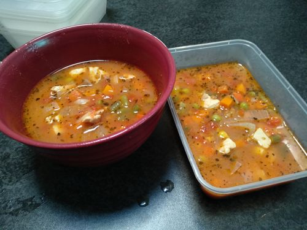
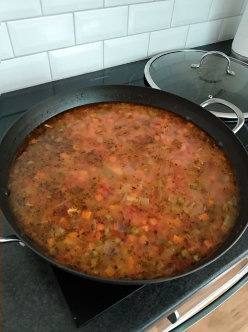

# Chicken Lentil Soup

Serves: 14

Time: 30min prep + 1hr cook

## Ingredients

* 0.5kg chicken (try 1kg next time)

* 2x Onion
* 1kg frozen veg
* 4tsp garlic paste
* 2tsp oregano
* 2tsp basil
* 2x bay leaf (optional)

* 800g crushed tomato
* 800g lentils (I used canned, but should try with dry lentils as per origional recipe)
* 4Tb Vinegar
* 2cup water (should be 10 cups if following origional recipe ratios, but too watery!)
* 6cup chicken stock

* 1cup Spinach (optional)

## Method

1. Dice and brown chicken
2. Dice and brown onion, frozen veg, garlic paste, oregano, basil, bay leaf
3. Combine chicken with other mixture
4. Add crushed tomato, lentils, vinegar, stock and water
5. Simmer for 1hr, stir occasionally. Add salt and paper + extra vinegar to flavour
6. Add spinach and cook until wilts

## Notes

Original: https://www.allrecipes.com/recipe/13978/lentil-soup/

Tags: Soup