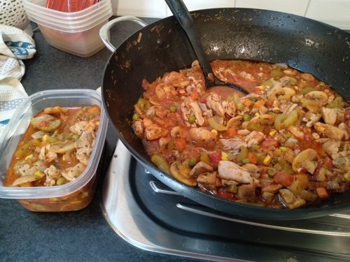

# Chicken and Mushroom One-pot

Serves: 16

Time: 1.5hr prep and cook

## Ingredients

* 2kg chicken thigh
* 600g button mushrooms
* 6 large celery sticks (or just 1 whole bunch)
* 3x red onions (we used 8x shallots)
* 4Tbs garlic
* 2Tbs tomato paste
* 2tea chilli
* 2Tbs thyme
* 2Tbs parsley
* 250ml apple cider vinegar (or white wine)
* 2x400g can diced tomato
* 370ml chicken stock
* Serve with couscous, rice or mashed potato

## Method

1. Cut up chicken, mushrooms, celery, onions. Defrost frozen veg. Prepare chicken stock
2. Brown chicken in large wok then remove 
3. Brown mushrooms for ~5min or till golden. Add celery, onion, garlic and frozen veg. Cook ~5min or till soft, stir occasionally.
4. Add tomato paste, vinegar and cook for ~2min, constantly stirring.
5. Add tomato, stock, chilli, parsly, thyme, chicken. Bring to boil. Simmer ~15min.

Serve with couscous, rice or mashed potato

## Notes

* Original recipe: https://www.taste.com.au/recipes/low-cal-chicken-mushroom-one-pot/clnk7ezq

