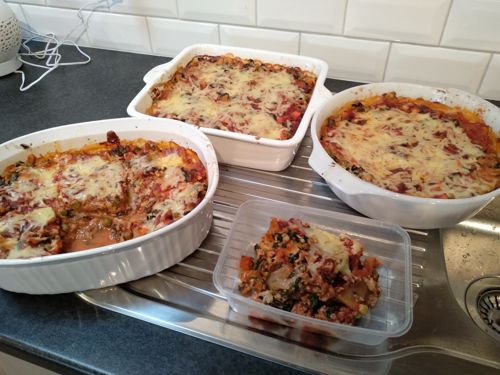

# Chilli Pork Lasagne

Serves: 17

Time: 60min prep + 30min cook

## Ingredients

* 500g lasagne sheets - wholemeal (fresh is perferable!)
* 200g cheddar cheese gratted
* oil & butter for greasing

### For pork and spinach sauce

* 1kg pork mince (original recipe suggest pork sausage meat)
* 500g frozen veg - defrested in boilding water and microwaved
* 500g sliced champinions
* 240g baby spinach - finely diced
* 400ml creme fraiche
* 2Tbs garlic
* 2Tbs chilli

### For tomato sauce

* 2x 700g tomato puree
* 2Tbs tomato paste
* 1Tbs thyme
* 1Tbs sage
* 2tsp sugar

## Method

1. Preheat oven to 200 degrees. Soak lasagne sheets in boiling water (if using dried sheets). Microwave frozen veg in boiling water. Finely dice baby spinach.

2. Pork and spinach sauce: brown pork mince. add chilli, garlic, mushrooms, frozen veg and fry for about 5min. Add spinach and creme fraiche. Season with salt and pepper. Bring to boil and cook for about 5min. Set aside.

3. Tomato sauce: Mix all ingredients in a bowl

4. Drain lasagne sheets. Grease baking dishes in butter

5. Spoon 1/3 of pork sauce into baking dish. Spoon 1/3 of tomato sauce. Using 1/2 the lasagne, cover in a layer of lasagne. Repeat until all sauce used. Top with grated cheese.

6. Bake for 30min

## Notes

* Original recipe: https://www.bbc.co.uk/food/recipes/express_lasagne_51375

