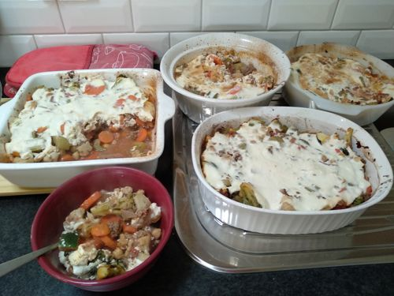

# Lamb Chickpea Veg Bake

Serves: 20

Time: 40min prep + 30min cook

## Ingredients

* 2kg frozen veg
* 6 tsp cumin
* 2 red onion - diced
* bunch of celery - diced
* 4 tsp garlic
* 2 tea cinnamon
* 1kg lamb mince
* 2x 400g can diced tomato
* 2x 400g can chickpeas
* 1x zuchinni (optional)
* 1.5 cup water
* 500g ricotta
* 500g natural yoghurt
* 2x egg (optional)

## Method

1. Preheat oven to 200 degrees. Lightly oil baking dishes, add frozen veg and sprinkle with 50% of cumin. Bake for 30min

2. Woke + oil on medium heat, cook onion, celery, zuchinni, garlic, cinnamon and remaining cumin. 
Cook for ~7min or until softened

3. Add mince, cook for ~5min or till browned.
Add diced tomato, + chickpeas (drained) and water. Bring to boil then simmer on low for ~20min or till thick

4. Combine in a bowl: ricotta, eggs, yoghurt. Season with salt

5. Add mince mixture into baking dishes, mix. Cover in ricotta sauce mix. Bake for ~30min

## Notes

* Baking frozen veg didn't really add any 'value' so this could be skipped in favour of defrost and just add in step 2, saving some pain and time. If you follow the original recipe it used raw pumpkin so it would be better in that case.

* Original recipe: https://www.taste.com.au/recipes/lamb-chickpea-pumpkin-bake/yeg46gzk

