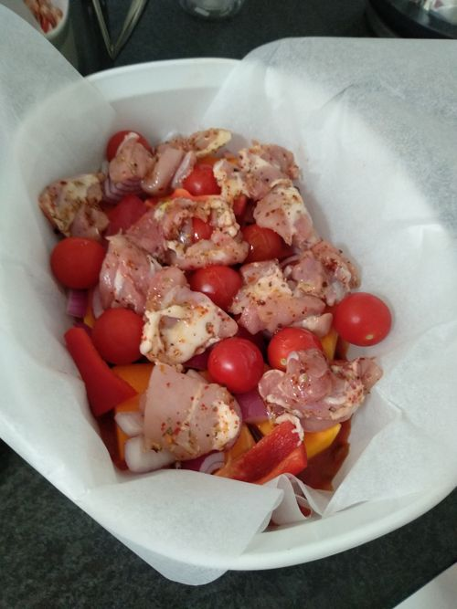
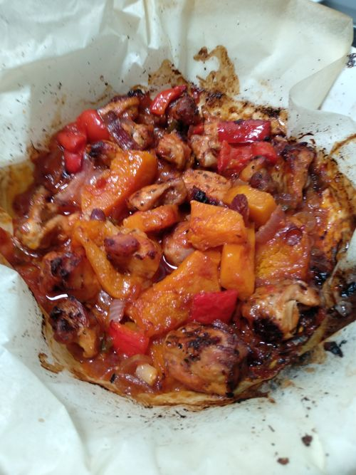
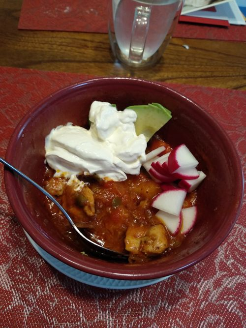

# Mexican Chicken Bake

Serves: 12

Time: 15min prep + 60min cook

## Ingredients

* 1.5kg chicken tigh
* 2tbs taco seasoning (did I use 4?)
* 1kg pumpkin, cubed
* 2 red onion, diced
* 2 red capsicum, cubed
* 400g (2 punnet) cherry tomato
* 400g sour cream
* 900g (4 tins) of tomato salsa

## Method

1. Preheat oven to 200 degrees. Line baking tray with baking paper. Combine chicken and taco seasoning in a large bowl
2. Spoon salsa over base of tray. Add pumpkin, onion, capsicum and tomatoes over the salsa. Top with chicken mixture. Drizzle with oil
3. Bake for ~60min, turning every ~20min, or until golden brown and veg cooked
4. Serve with a spoon of sour cream

## Notes

* Next time try adding ~500g frozen veg 

* Original recipe has extra garnishes which are not needed as the recipe is packed with flavour

* Original recipe: https://www.taste.com.au/recipes/mexican-style-chicken-tray-bake-recipe/663whe0g

