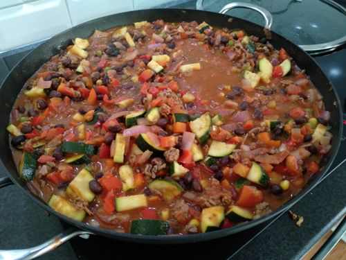

# Nachos

Serves: 24

Time: 20min prep + 20min cook

## Ingredients

* 1kg corn tortillas, cut into wedges

* 700g mince

* 4x red onions, finely chopped
* 8tsp garlic
* 4tsp chilli
* 4tsp paprika
* 4tsp cumin
* 4x red capsicum, diced
* 4x zuchini, diced
* 4x 400g cans of black beans, drain & rinse
* 4x 400g cans of diced tomato
* 1 small bowl frozen veg, defrosted
* 300ml water
* squirt of lime (optional)
* 2tsp corriander (optional)
* 500g natural yoghurt or sour cream (optional but recommended)

## Method

1. Preheat oven to 200 degrees, cut tortillas into wedges and put on baking paper. Lightly coat in oil. Bake ~10mins, turning once or until golden and crisp
2. Brown mince in saucepan
3. Add onion, garlic, chilli, paprika, capsicum, zuchini, corridander in saucepan on medium heat with some oil till softened
4. Add black beans, tomatoes, frozen veg, water, squirt of lime. Bring to boil then simmer for 10min or until thickened
5. Serve bean mix with tortilla crisps. Top with optional yoghurt, fresh coriander, lime, paprika

## Notes

* Sauce can be cooked and frozen then just prepare corn wedges on the day you want to eat

* Should be amazing with some cheese on top

* Original recipe: https://www.taste.com.au/recipes/healthy-vegetarian-nachos-recipe/baf2z4s1?r=healthy&h=Healthy

