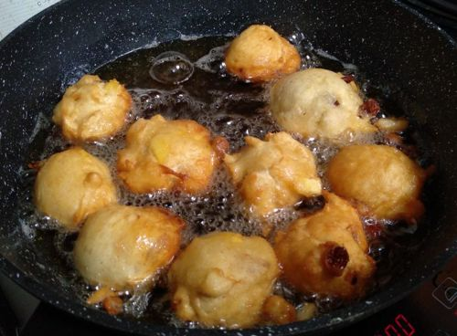
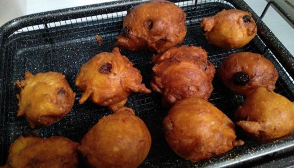

# Oliebollen/Berliner - Dutch Oil Balls

Serves 10

## Ingredients

* 4 cups flour
* 2 cup milk/buttermilk
* 4Tb butter (if using milk)
* 3tsp yeast
* 2Tb sugar
* 1tsp salt
* 2 eggs

## Extras

* 1/2 cup raisins (soaked in water for 15m)
* 1-2 apples
* 2tsp cinnamon/mixed spice
* powder with icing sugar
* inject warm jam

## Method

1. Warm milk and mix with sugar, yeast beaten egg and salt
2. Add flour and mix
3. Add extras
4. Proof for 1hr if making oliebollen
5. If making berliner kneed, reduce milk slightly, and cut into balls, rise 2hr
6. Use 2 oil diped spoons to shape into balls and deep fry 180C for about 3min in saucepan ~1L oil

## Notes

https://www.youtube.com/watch?v=t4RNm_BY-5E

https://www.youtube.com/watch?v=kvWDaLH2qW8

https://www.youtube.com/watch?app=desktop&v=Q2aveTL9Ix4

