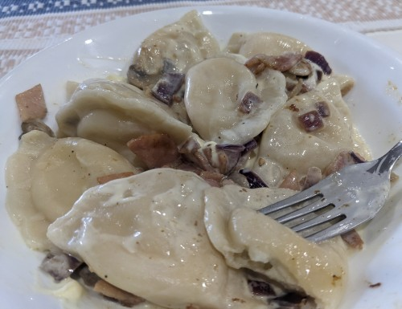

# Pierogi Polish Dumplings

Serves 4  
Prep 5 min  
Cook 10 min  

## Ingredients

* 1 kg pierogi 
* 200-300 g bacon cubed
* 1 red onion cubed
* 200 g mushrooms sliced
* 1 small tub sour cream 

## Method

1. Boil pierogi till floats, then simmer for 4 more mins.
2. While boiling, cook onion, add bacon, then mushroom till golden brown.
3. Serve with large dolop sour cream.

## Notes

https://www.allrecipes.com/recipe/109914/pierogi-polish-dumplings/

