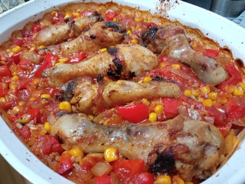

# Portuguese Chicken Bake

Serves: 14
Time to make: 30min prep/pre-cook + 1hr bake

## Ingredients

* 2cup rice (we used borwn rice)
* 3tbs portuguese spice
* 1tsp parsley
* 4tsp brown sugar
* 2 lemons juiced + rind
* 1.5kg chicken legs (next time we want to use 2kg)
* 2 brown onion, diced
* 4tsp garlic
* 2 red capsicums, diced
* 500g frozen corn kernels
* 2x400g can diced tomato
* 2cup chicken stock

## Method

1. Cut onion, capy, rind n squeeze lemon

2. Preheat oven to 200deg. Grease baking dishes. Combine portuguese spice, parley, sugar, lemon and rind in a large bowl. Add chicken and coat well in mixture.

3. In a large woke/frying pan, medium heat oil. Cook chicken in batches till golden borwn (~5min)

4. Add oil, onion, garlic and remaining spice mix to frying pan for ~6min till soft

5. Add capy, corn, rice, tomatoes and stock. Bring to boil. Pour into baking dish

6. Add chicken on top and press into rice mix a little. Cover with foil. Bake for 25min

7. Remove foil, bake for 30min

## Notes

I think a dolop of yoghourt/sour cream would go well with this

Original recipie: https://www.sunrice.com.au/rice-recipes/portuguese-chicken-bake/

