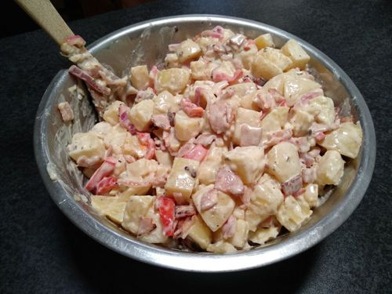

# Potato Salad

Serves 6-8

Makes 1 large bowl

## Ingredients

* 1/2kg bacon
* 2kg potatoes
* 1.5 bottles potato dressing
* 1 capcicum
* 1 red onion
* 1/2 cup vinegar

## Extras

* mixed veg
* spring onions/chives
* mustard

## Method

1. Peel, cut and boil potatoes till firm-soft
2. Dice bacon and onion, give a quick fry in butter and oil
3. Mix
4. Refrigerate
5. Add extras sauce to make fresh before serving

## Notes

