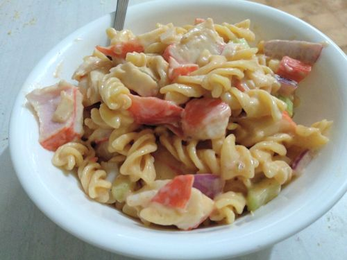

# Seafood Salad

Serves 10

## Ingredients

* 1kg seafood mix, cubed
* 500g pasta
* 3 bottles thousand island - rinse with vinegar
* 2 red capcicum
* 2-3 stick celary
* 2 red onion

## Extras

* 1/4 cup mayo
* tinned corn
* shredded chicken

## Method

1. Cook pasta, drain, dont rinse, allow to cool to become sticky
2. Dice ingredients
3. Mix
4. Best left overnight for pasta to absorb sauce

## Notes

