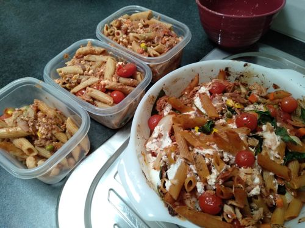

# Tuna/Salmon Pasta Bake

Serves: 26

Time to make: 20min prep + 20min cook

## Ingredients

* 3x 425g tin Tuna or Red Salmon
* 2x 500g Wholemeal pasta
* 1x 500g frozen Cauliflower
* 1x 500g frozen mixed veg
* 3x Brown onion
* 4x 400g tin Cherry Tomato
* 1x 500g Ricotta (Can hardly taste, try fetta next time?)
* 120g bag baby Spinach (optional)
* 4Tbs garlic
* $Tbs balsamic vinegar
* Sprinkle of basil spice
* Parmy (optional)

## Method

1. Preheat oven to 200deg. Cook pasta for ~10 min with frozen veg. Drain
2. Medium heat oil in frying pan. Brown onion, garlic; then add tomato and vinegar
3. Combine pasta, veg, tomato mix, tuna (keep 50% of juice for extra juice n flavour), spinach in baking dish. Cover in ricotta and parmy (optional). Sprinkle with basil. Bake for ~20min

## Notes

I used Tuna, but Red salmon is given in the origional recipie which might have a stronger flavour.

Serve with a sprinkle of parmy instead of adding it at bake time.

Original recipe: https://www.taste.com.au/recipes/healthy-salmon-pasta-bake/mE43UGJi

