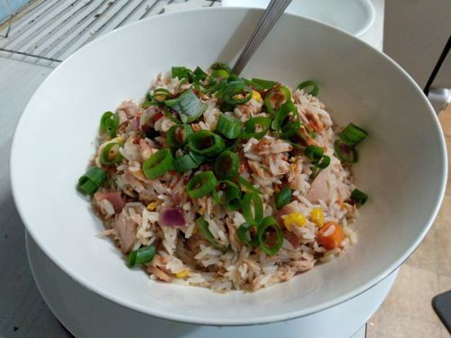

# Tuna Salad

Serves 2

## Ingredients

* 1 cup rice
* 1 cup tuna (preferably in oil for flavour)
* 1/2 capcicum
* 1/2 red onion
* spring onion
* 1/3 cup rice vinegar
* 2tsp soy sauce
* 1/2tsp seasame oil
* 1-2tsp siracha
* 1/2 lemon juice
* pinch chilli flakes

## Extras

* peas/mixed veg
* bacon

## Method

1. Cook rice
2. Add ingredients
3. Serve warm or cold

## Notes

