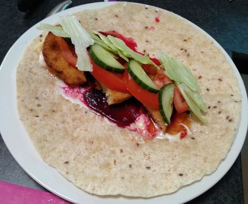

# Wraps & Burgers

Serves: As many as you need
Time to make: 10min

## Ingredients

* Wraps or bread (toast is better than fresh)
* Some meat - Aldi chicken schnitzels, or IKEA Meatballs
* Some sauce
* Mayo
* Beetroot
* Lettuce
* Tomato
* Cheese
* Cucumber (optional)

## Method

1. Cook meat as required
2. Apply sauce to wrap/toast
3. Add ingredients
4. Wrap/cover and eat

## Notes

Chicken schnitzels - recommend using sweet chilli sauce + mayo or chipotle

IKEA Metballs - recommend using tomato sauce + mayo

You can experiment with different types of mayo or salad dressings and sauces. eg. Coldslaw dressing or adding a touch of greek salad dressing

